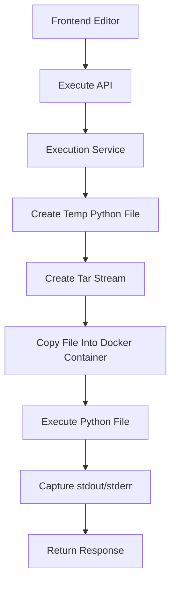

# Secure Python Code Execution Setup

This project uses Docker + Dockerode for secure Python code execution inside an isolated sandbox container.

---

# Tech Stack

- Node.js
- Express.js
- Docker
- Dockerode
- Python 3.11
- tar-fs

---

# Project Structure

```text
backend/
│
├── docker/
│   └── executor/
│       └── python/
│           └── Dockerfile
│
├── src/
│   ├── container/
│   │   └── docker.js
│   │
│   ├── modules/
│   │   └── execution/
│   │       ├── controllers/
│   │       ├── routes/
│   │       ├── services/
│   │       └── temp/
│   │
│   └── projects/
```

---

# Dockerfile

Path:

```text
backend/docker/executor/python/Dockerfile
```

Content:

```dockerfile
FROM python:3.11-alpine

RUN adduser -D appuser

USER appuser

WORKDIR /app

CMD ["sh"]
```

---

# Install Dependencies

```bash
npm install dockerode tar-fs uuid
```

---

# Build Docker Image

Run from backend root:

```bash
docker build -t code-executor-python ./docker/executor/python
```

---

# Verify Docker Image

```bash
docker images
```

Expected image:

```text
code-executor-python
```

---

# Create Persistent Sandbox Container

```bash
docker run -dit --name python-sandbox code-executor-python sh
```

---

# Verify Running Container

```bash
docker ps
```

Expected container:

```text
python-sandbox
```

---

# Start Existing Container

```bash
docker start python-sandbox
```

---

# Stop Container

```bash
docker stop python-sandbox
```

---

# Restart Container

```bash
docker restart python-sandbox
```

---

# Remove Container

```bash
docker rm -f python-sandbox
```

---

# Open Shell Inside Container

```bash
docker exec -it python-sandbox sh
```

---

# Verify Python Installation

```bash
docker exec python-sandbox python --version
```

---

# Current Execution Architecture



---

# Useful Docker Commands

## View Running Containers

```bash
docker ps
```

---

## View All Containers

```bash
docker ps -a
```

---

## View Docker Images

```bash
docker images
```

---

## Check Container Logs

```bash
docker logs python-sandbox
```

---

## Inspect Container

```bash
docker inspect python-sandbox
```

---

## Check Running Processes

```bash
docker exec python-sandbox ps aux
```