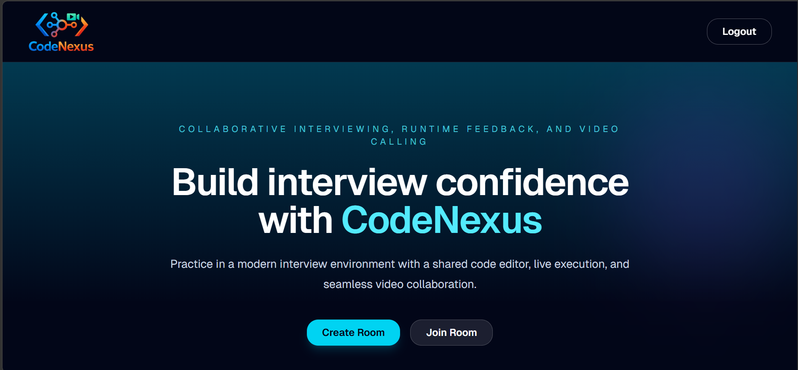
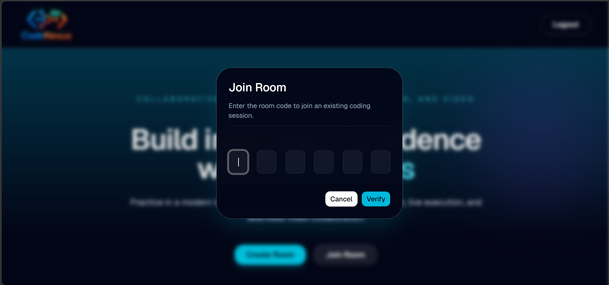
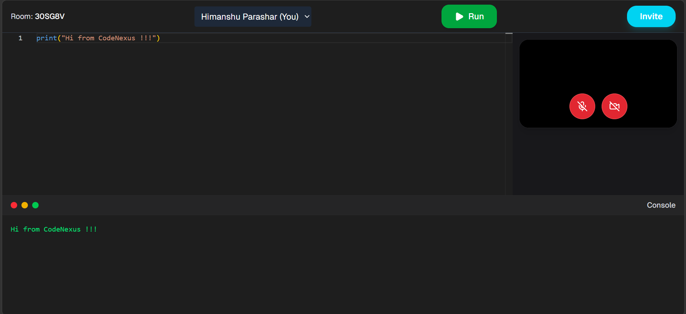

# CodeNexus

CodeNexus is a full-stack collaborative interview platform that supports:

* Real-time collaborative code editor using YJS + CRDT
* Video calling using WebRTC
* Real-time communication using Socket.IO
* Authentication system with OTP email verification
* Redis queues using BullMQ
* Docker-based code execution sandbox
* Monaco code editor
* Persistent YJS collaboration
* MongoDB database
* Production deployment using AWS EC2 + NGINX + PM2

---

# Tech Stack

## Frontend

* React.js
* Vite
* Tailwind CSS
* Monaco Editor
* YJS
* y-websocket
* Socket.IO Client
* Axios
* Zustand

## Backend

* Node.js
* Express.js
* MongoDB
* Redis
* BullMQ
* Docker
* Socket.IO
* WebRTC Signaling
* YJS
* ws

## Deployment

* AWS EC2
* NGINX
* PM2
* DuckDNS
* Certbot SSL
* Vercel

---

# Features

## Authentication

* User signup/login
* OTP email verification
* JWT authentication
* Redis queue-based email processing

## Collaborative Code Editor

* Monaco editor
* Real-time collaboration using YJS
* CRDT-based synchronization
* Persistent shared documents

## Code Execution

* Docker-based sandboxed code execution
* Isolated execution environment
* Python executor support

## Video Calling

* WebRTC-based peer-to-peer video calls
* STUN server support
* Real-time room communication

## Room Management

* Create interview rooms
* Join interview rooms
* Real-time room updates

---

# Project Structure

```bash
CodeNexus/
│
├── frontend/
│   ├── src/
│   ├── public/
│   └── package.json
│
├── backend/
│   ├── src/
│   ├── docker/
│   ├── package.json
│   └── .env
│
└── README.md
```

---

# Prerequisites

Install the following before running the project:

* Node.js (v18 or above recommended)
* MongoDB
* Docker
* Redis
* Git

---

# Clone Repository

```bash
git clone https://github.com/hp1430/CodeNexus.git
```

```bash
cd CodeNexus
```

---

# Frontend Setup

## Navigate to frontend

```bash
cd frontend
```

## Install dependencies

```bash
npm install
```

## Create .env file

Create a `.env` file inside frontend folder.

```env
VITE_V1_BACKEND_URL=http://localhost:3000/api/v1

VITE_V1_BACKEND_WS_URL=http://localhost:3000

VITE_YJS_WEBSOCKET_URL=ws://localhost:4000

VITE_WS_PORT=4000

VITE_STUN_SERVER_URL=stun:stun.l.google.com:19302
```

## Start frontend

```bash
npm run dev
```

Frontend will run on:

```bash
http://localhost:5173
```

---

# Backend Setup

## Navigate to backend

```bash
cd backend
```

## Install dependencies

```bash
npm install
```

---

# MongoDB Setup

Start MongoDB locally.

Example MongoDB local connection:

```env
mongodb://127.0.0.1:27017/codenexus
```

---

# Redis Setup

## Run Redis using Docker

```bash
docker run -d --name redis-bullmq -p 6379:6379 redis
```

Verify Redis container:

```bash
docker ps
```

---

# Backend Environment Variables

Create `.env` inside backend folder.

```env
PORT=3000

MONGO_URI=mongodb://127.0.0.1:27017/codenexus

JWT_SECRET=your_jwt_secret

JWT_EXPIRY=1d

REDIS_HOST_IP=127.0.0.1

REDIS_PORT=6379

EMAIL_USER=your_email

EMAIL_PASS=your_email_password

WS_PORT=4000
```

---

# Docker Code Executor Setup

## Install Docker

Verify Docker installation:

```bash
docker --version
```

---

# Python Executor Dockerfile

Path:

```bash
backend/Dockerfile
```

Content:

```Dockerfile
FROM python:3.11-alpine

RUN adduser -D appuser

USER appuser

WORKDIR /app

CMD ["sh"]
```

---

# Build Docker Image

Run from backend root:

```bash
docker build -t code-executor-python .
```

Verify image:

```bash
docker images
```

---

# Create Persistent Sandbox Container

```bash
docker run -dit --name python-sandbox code-executor-python sh
```

Verify running container:

```bash
docker ps
```

Verify Python installation:

```bash
docker exec python-sandbox python --version
```

---

# Start Backend Server

```bash
npm run dev
```

OR

```bash
node src/server.js
```

Backend runs on:

```bash
http://localhost:3000
```

---

# Start Email Worker

Open another terminal.

Navigate to backend:

```bash
cd backend
```

Run:

```bash
node src/workers/emailWorker.js
```

---

# Start YJS WebSocket Server

Open another terminal.

Navigate to backend:

```bash
cd backend
```

Run:

```bash
node src/ws/yjsServer.js
```

YJS server runs on:

```bash
ws://localhost:4000
```

---

# Running The Full Project Locally

You must have ALL of these running simultaneously:

| Service              | Port     |
| -------------------- | -------- |
| Frontend             | 5173     |
| Backend API          | 3000     |
| Redis                | 6379     |
| YJS WebSocket Server | 4000     |
| Docker Sandbox       | Internal |

---

# OTP Verification Flow

## Signup Flow

1. User signs up
2. OTP generated
3. OTP hashed using bcrypt
4. OTP stored in database
5. Job pushed to BullMQ queue
6. Worker consumes queue
7. Email sent to user
8. User verifies OTP

---

# YJS Collaboration Flow

1. User joins room
2. Frontend connects to YJS websocket server
3. Shared YJS document created
4. Monaco editor syncs with YJS document
5. CRDT handles real-time collaboration

---

# Video Calling Flow

1. Users join same room
2. Socket.IO exchanges signaling data
3. WebRTC peer connection created
4. STUN server assists ICE candidate discovery
5. Direct peer-to-peer video communication established

---

# Production Deployment

## Frontend Deployment

Frontend is deployed using Vercel.

Production frontend environment variables:

```env
VITE_V1_BACKEND_URL=https://codeenexus.duckdns.org/api/v1

VITE_V1_BACKEND_WS_URL=https://codeenexus.duckdns.org

VITE_YJS_WEBSOCKET_URL=wss://codeenexus.duckdns.org/ws

VITE_WS_PORT=443

VITE_STUN_SERVER_URL=stun:stun.l.google.com:19302
```

---

# AWS EC2 Deployment

## Connect to EC2

```bash
ssh -i your-key.pem ubuntu@your-ec2-ip
```

---

# Install Node.js

```bash
sudo apt update
```

```bash
curl -fsSL https://deb.nodesource.com/setup_20.x | sudo -E bash -
```

```bash
sudo apt install -y nodejs
```

---

# Install Docker

```bash
sudo apt install docker.io -y
```

```bash
sudo systemctl start docker
```

```bash
sudo systemctl enable docker
```

---

# Install PM2

```bash
sudo npm install -g pm2
```

---

# Clone Project On EC2

```bash
git clone https://github.com/hp1430/CodeNexus.git
```

---

# Backend Production Setup

Navigate to backend:

```bash
cd backend
```

Install dependencies:

```bash
npm install
```

Create `.env` file.

---

# Build Docker Executor

```bash
sudo docker build -t code-executor-python .
```

Create sandbox container:

```bash
sudo docker run -dit --name python-sandbox code-executor-python sh
```

---

# Start Backend Services Using PM2

## Start backend server

```bash
pm2 start src/server.js --name backend
```

## Start email worker

```bash
pm2 start src/workers/emailWorker.js --name email-worker
```

## Start YJS server

```bash
pm2 start src/ws/yjsServer.js --name yjs-server
```

---

# Useful PM2 Commands

## List processes

```bash
pm2 list
```

## Restart all services

```bash
pm2 restart all
```

## Restart single service

```bash
pm2 restart yjs-server
```

## View logs

```bash
pm2 logs
```

## Save PM2 processes

```bash
pm2 save
```

---

# NGINX Setup

Install nginx:

```bash
sudo apt install nginx -y
```

---

# DuckDNS Setup

1. Create DuckDNS account
2. Create subdomain
3. Point domain to EC2 public IP

Example:

```text
codeenexus.duckdns.org
```

---

# SSL Setup Using Certbot

Install certbot:

```bash
sudo apt install certbot python3-certbot-nginx -y
```

Generate SSL:

```bash
sudo certbot --nginx -d codeenexus.duckdns.org
```

---

# NGINX Configuration

Open config:

```bash
sudo nano /etc/nginx/sites-available/codenexus
```

Example configuration:

```nginx
server {
    server_name codeenexus.duckdns.org;

    location /ws/ {
        rewrite ^/ws/(.*)$ /$1 break;

        proxy_pass http://localhost:4000;

        proxy_http_version 1.1;

        proxy_set_header Upgrade $http_upgrade;
        proxy_set_header Connection $connection_upgrade;

        proxy_set_header Host $host;

        proxy_read_timeout 86400;
    }

    location / {
        proxy_pass http://localhost:3000;

        proxy_http_version 1.1;

        proxy_set_header Host $host;
        proxy_set_header X-Real-IP $remote_addr;
        proxy_set_header X-Forwarded-For $proxy_add_x_forwarded_for;
    }

    listen 443 ssl;
}
```

---

# Restart NGINX

Test config:

```bash
sudo nginx -t
```

Restart nginx:

```bash
sudo systemctl restart nginx
```

---

# WebSocket Debugging

Useful commands:

## PM2 logs

```bash
pm2 logs yjs-server
```

## NGINX access logs

```bash
sudo tail -f /var/log/nginx/access.log
```

## NGINX error logs

```bash
sudo tail -f /var/log/nginx/error.log
```

## Test websocket manually

Install wscat:

```bash
npm install -g wscat
```

Test websocket:

```bash
wscat -c wss://codeenexus.duckdns.org/ws/test-room
```

---

# Common Issues

## Mixed Content Error

Cause:

* frontend using HTTPS
* backend/websocket using HTTP

Fix:

Use:

```env
https://
wss://
```

in production.

---

# WebSocket Connection Failed

Possible reasons:

* nginx websocket proxy misconfiguration
* SSL issues
* wrong websocket URL
* YJS server not running

---

# Docker Build Path Error

Cause:

Wrong Dockerfile path.

Fix:

Run command from backend root:

```bash
docker build -t code-executor-python .
```

---

# Verify Full System

## Frontend

```bash
http://localhost:5173
```

## Backend

```bash
http://localhost:3000
```

## YJS WebSocket

```bash
ws://localhost:4000
```

## Redis

```bash
localhost:6379
```

---

# Future Improvements

* Multi-language code execution
* Kubernetes deployment
* TURN server integration
* AI interview assistant
* Collaborative whiteboard
* Screen sharing
* Docker autoscaling
* Role-based access control

---

# Author

Himanshu Parashar

GitHub:

[https://github.com/hp1430](https://github.com/hp1430)
[https://www.linkedin.com/in/hp1430/](https://www.linkedin.com/in/hp1430/)

---

# Project Snapshots






